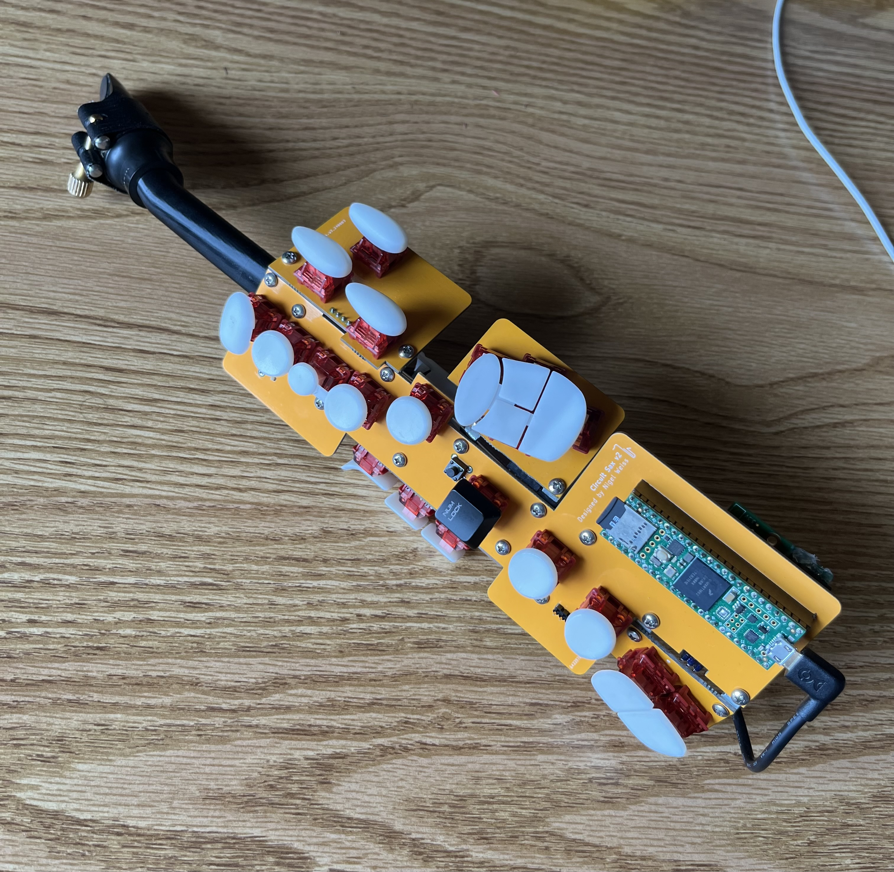
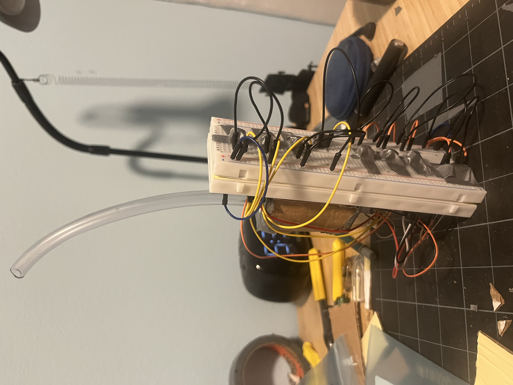
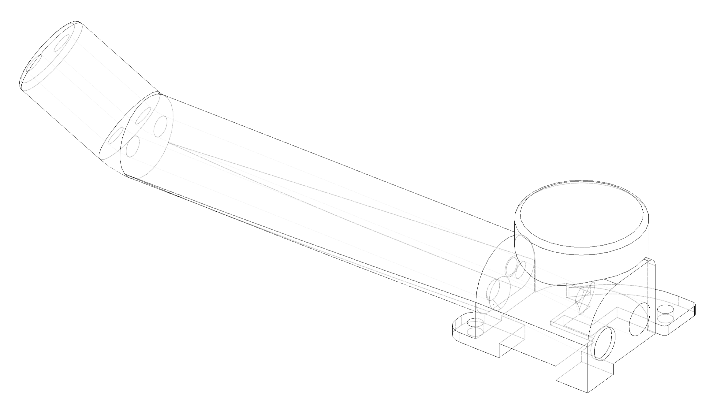
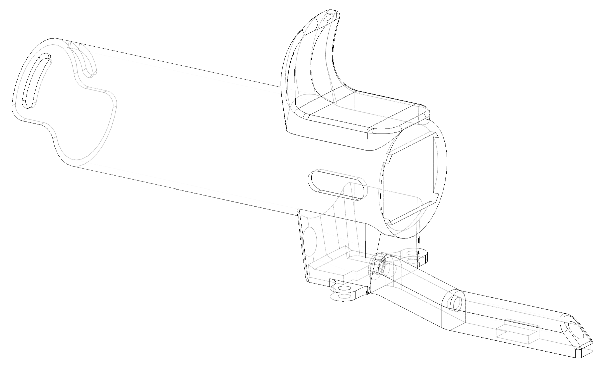
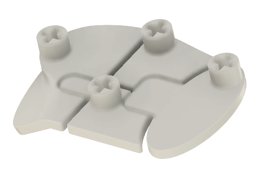
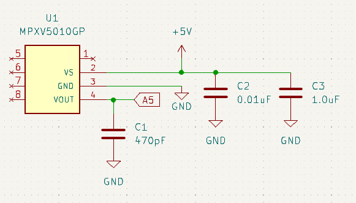
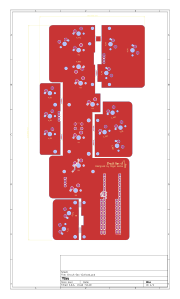
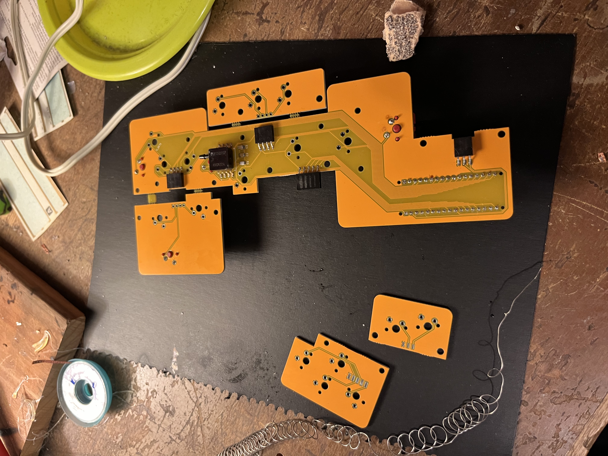

# Circuit Sax

The Circuit Sax is a mini electronic saxophone. Made with mechanical switches, custom 3D printed keycaps, and breath input, it’s designed to feel as close to a regular saxophone as possible. Almost anything you can play on a real saxophone, you can translate to the Circuit Sax.

Circuit Sax is in its second version. See [Circuit Sax v1](v1) for the original set of features.

### Features

- Mechanical key switches with custom keycaps meant to mimic the feel of a saxophone
- Breath input for articulation of notes and dynamic expression (compatible with any alto saxophone mouthpiece)
- Motion detection for vibrato
- Audio output via 3.5mm audio jack
- MIDI output via USB to a computer or phone

### Components

- **MPXV5010GP** - Pressure sensor for breath input
- **Haimu Heartbeat Silent Linear Switches** - Mechanical switches for the keys
- **Teensy 4.1** - Microcontroller board for processing audio and sending MIDI output
- **Teensy 4 Audio Shield (Rev D)** - Audio extension board for the teensy for processing and sending audio output
- **Custom 3D Prints** - For the mouthpiece neck, battery holder, thumb rests, and keys
- **Custom PCBs** - Circuit boards used as the body
- **5V Portable Charger** - Battery that powers the Teensy via USB
- **MPU6050 Module** - Accelerometer and gyroscope sensor module to detect motion used for vibrato
- **Alto Saxophone Mouthpiece** - Mouthpiece for blowing into the instrument

## The Whole Process

- [Overall Design](#overall-design)
- [Choosing Components](#choosing-components)
- [Designing the models](#designing-the-models)
- [Electrical Design](#designing-the-pcb)
- [Assembly](#assembly)
- [Programming](#programming)

### Overall Design

After originally making a prototype out of breadboards (shown above), I wanted to make a new version using a PCB as the body, mechanical switches for buttons, and 3D prints for the mouthpiece, thumb rest, and keys. However, I wasn't sure what I would do about the side keys. After finding [this project](https://github.com/cardonabits/haxo-hw) by Javier Cardona, I decided I would do something similar and attach additional smaller PCBs to the sides with angle brackets and electrical header pins.

In contrast to the [Haxophone](https://github.com/cardonabits/haxo-hw), I wanted to position the keys to be more accurate. In CAD, I positioned all the keys and angled the side PCBs based on measurements from my soprano sax. In order to make sure everything would fit properly, I spent months modeling the entire thing, including mechanical switches, 3D prints, brackets, nuts, bolts, and electrical components.

### Choosing Components

- For the breath sensor, I chose a [MPXV5010GP pressure sensor](https://www.digikey.com/en/products/detail/nxp-usa-inc/MPXV5010GP/951847?s=N4IgTCBcDaILYAcAeA3ArABgIwYOYJAF0BfIA) since that was what many other similar projects use, so I assumed it would do what I needed.
- For the microcontroller, I decided to use a [Teensy 4.1](https://www.pjrc.com/store/teensy41.html) along with the [Teensy 4 Audio Shield (Rev D)](https://www.sparkfun.com/teensy-4-audio-shield-rev-d.html). The Teensy is well known for its audio processing abilities. The Teensy Audio Library is very powerful and would allow me to easily make synthesized sound presets.
- For the mechanical switches, I chose [Haimu Heartbeat Silent Linear Switches](https://cannonkeys.com/products/haimu-heartbeat-silent-linear-switch?srsltid=AfmBOoo-FxAV9BJslixNNQ3mZ6u7veaNx8jfjfWYgJqzr-3P1V7ygZ23) because silent switches wouldn't disturb others, and the heavier spring weight would be more similar to a real saxophone.
- For the electrical connections to other PCBs (for the side keys), I got various header pins and sockets that I would have to bend in specific angles in order to fit properly. I figured that if they broke, I would just use wires as a plan B.
- I chose to use a portable phone charger for the battery simply because it was a quick and easy solution that would allow for a clean audio signal.

### Designing the Models

Since I didn't have access to a quality 3D printer, I decided to use [JLCPCB's 3D printing service](https://jlc3dp.com/?source=JLCPCB-top-productbar) and get my prints online. This meant I would have to be very thorough in making sure each part would work before ordering them.
I modeled the mouthpiece neck, thumb rest, and all the keycaps in the same Fusion 360 project as the entire thing so that everything would align properly and I would get a visual sense of what it would look like.

#### Mouthpiece Neck / Left Thumb Rest

For the mouthpiece neck, I had to come up with a design that would allow enough pressure to reach the sensor while also making sure that it wouldn't get exposed to moisture. In other EWI designs I researched, both homemade and professional, it seemed as though the airflow split at the mouth into two equal channels, one for the breath sensor and one for moisture drainage and airflow. I was concerned that moisture would reach the sensor, however after reading somewhere that most of the moisture comes from condensation and condensation only happens in the tube that doesn't have air flow through it, I decided to use this design. _(Turns out I was wrong, because some moisture does build up in the sensor tube. I will want to use a different design in the future.)_

Since having two separate parts for the neck and left thumb rest would create unnecessary distance between them, I designed the mouthpiece neck and left thumb rest to be the same part. Both air channels would flow through the thumb rest. The sensor channel would be aligned with the pressure sensor so that it can be connected directly with a short vinyl tube.

#### Right Thumb Rest

I designed the right thumb rest to also act as an extension for the drainage tube. A channel goes through the thumb rest and extends into a tube which ends at the very bottom of the board. A vinyl tube would connect this channel with the drainage channel of the left thumb rest.

The thumb rest is also a holder for the battery. A tube extends from the top side of the thumb rest which holds the battery. The bottom side of the thumb rest is open for access to USB ports on the bottom of the battery. A small window on the side of the tube is also open, exposing the battery level indicator.

I used form modeling in Fusion 360 to make this thumb rest as realistically smooth as possible.

In addition, notches on the bottom of both thumb rests allow space for electrical header sockets and the bottom the mechanical switches on the other side of the board.

#### Keycaps

In order for the keycaps to properly fit the stems of the switches, I needed to order a few tests prints with varied size tolerances to see what would fit best.

I designed each key to have as similar of a shape as possible to a real sax. Some details include the concavity on the primary keys, the lip on the top side key, and the different angles of the palm keys. Every detail was carefully measured or eyeballed on my real sax.

Some keys, such as the G sharp key and bis key have tabs so that when another key is pressed next to it, it will also get pressed. This has no function, but makes it feel more realistic. (Shown below)

On some keys, such as the G sharp key shown above, the stem (where it connects to the switch) is offset so that the key can be in the ideal position.

### Electrical Design

The electrical design is very simple since I'm using premade Teensy and Teensy Audio Shield dev boards. The Teensy is plugged into 2 rows of header sockets on the board. Each switch is connected to a digital pin on the Teensy and ground. Switches on separate board are connected to main board with header pins, and then connected to the Teensy. The MPXV5010GP pressure sensor is connected to 5 volts on the Teensy with 2 decoupling capacitors, an analog pin on the Teensy with 1 decoupling capacitor for the data output, and ground. The MPU6050 module is connected with I2C.

I designed the circuit board in [KiCad](https://www.kicad.org/), properly positioning every component and sizing the board according to my CAD model.

#### Circuit Board Aesthetics

Since the circuit board was going to be the body of the device, I wanted it to look good. I neatly aligned the traces, rounded the corners, made a logo, and ordered it in yellow.

### Assembly

I ordered the PCB from [JLCPCB](https://jlcpcb.com/). After the PCB and electrical components had arrived, it was time to get building. Assembly consisted of:

- Separating the 5-part PCB and sanding the edges
- Soldering all electrical components onto the circuit board, such as the breath sensor, small SMD capacitors, headers, and mechanical switches
- Bending brackets - _In order to attach the smaller PCBs at specific angles, I had to bend right angle brackets by hand. I had to experiment with a combination of hammering them and using pliers, or else they wouldn't bend properly._
- Applying conformal coating - _After soldering everything on, I applied conformal coating to the back of the PCB so that it would protect the electronics. Because I used a brush, the coat doesn't look very even, however I don't have a way to remove it and I don't want to make it worse by adding another coat._
- Screwing everything together

_The image below is from the assembly of version 1_

### Programming

I used the [Teensy Audio Library](https://www.pjrc.com/teensy/td_libs_Audio.html) to generate synthesized audio output from the Teensy. The Teensy [Audio System Design Tool](https://www.pjrc.com/teensy/gui/) was helpful for connecting waveforms, filters, effects, and mixers together to create the sound that I wanted. I mapped the amplitude and filter cutoff of the sound to the reading of the pressure sensor for dynamic expression. The pitch of the sound is determined by what combination of notes is pressed, as well as motion read by the MPU6050 sensor (for vibrato).
