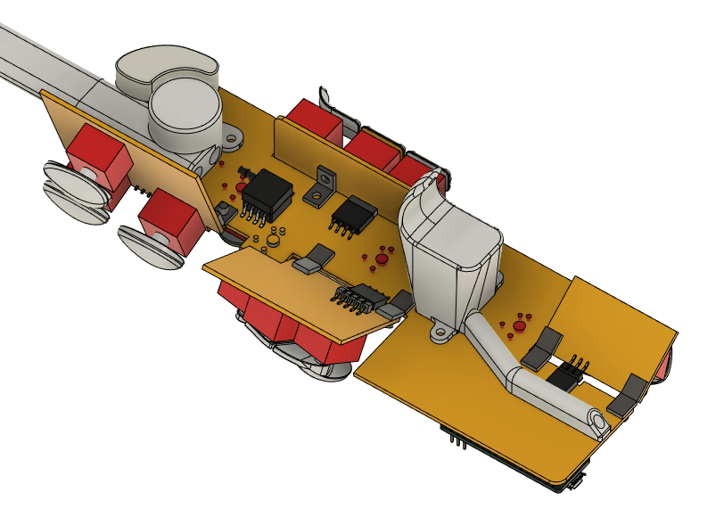
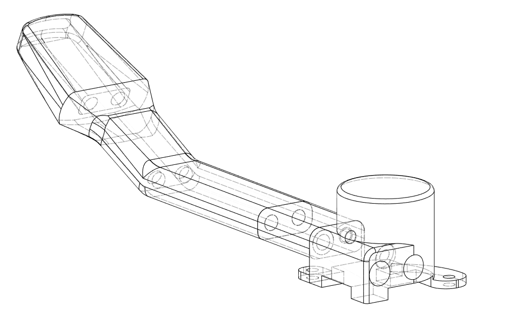

# Circuit Sax

The Circuit Sax is a saxophone MIDI controller. It lets you play any software instrument you’d like using saxophone fingerings, allowing you to practice without disturbing others, create music in any DAW, and even perform with it. It’s designed to feel as close to a regular saxophone as possible so that it won’t feel unfamiliar to the player.

  
  
  

https://github.com/user-attachments/assets/63f0f66c-cf19-42e7-976a-ba243b47ed39

### Features

- Breath input to trigger/release notes and control the **Mod Wheel** to map to any synth parameter
- Mechanical key switches with custom keycaps meant to mimic the feel of a saxophone
- MIDI output via USB to a computer or phone

### Components

- **MPXV5010GP** - Pressure sensor for breath input
- **Haimu Heartbeat Silent Linear Switches** - Mechanical switches for the keys
- **Arduino Micro** - Microcontroller board for sending MIDI output
- **Custom 3D Prints** - For the mouthpiece, thumb rests, and keys
- **Custom PCB** - Circuit board used as the body

> ### Can be a Nintendo Switch controller, too!
>[Circuit-Sax-Switch-Controls](https://github.com/Whackalenso/Circuit-Sax-Switch-Controls/) lets you use the Circuit Sax as a controller designed for Smash Bros by plugging it into a switch via USB.

### Acknowledgements

[The Haxophone](https://github.com/cardonabits/haxo-hw) by Javier Cardona was a major inspiration for the overall design concept of using a PCB as the body. I would recommend checking it out. 

## The Whole Process

- [Overall Design](#overall-design)
- [Choosing Components](#choosing-components)
- [Designing the models](#designing-the-models)
- [Electrical Design](#designing-the-pcb)
- [Assembly](#assembly)
- [Programming](#programming)

### Overall Design

After originally making a prototype out of breadboards (shown above), I wanted to make a new version using a PCB as the body and 3D prints for the mouthpiece and thumb rest. Although many EWIs use touch capacitive buttons for the keys, I decided to use mechanical key switches and custom keycaps instead so that it would feel more realistic. 

In order for the key layout to be as accurate as possible and for everything to fit properly, I spent months modeling the entire thing in CAD. I positioned and angled all the keys according to measurements from my soprano sax, modeled the 3D prints, and made sure nothing would interfere with the brackets, nuts, bolts, and electrical components.

### Choosing Components

- For the breath sensor, I chose a [MPXV5010GP pressure sensor](https://www.digikey.com/en/products/detail/nxp-usa-inc/MPXV5010GP/951847?s=N4IgTCBcDaILYAcAeA3ArABgIwYOYJAF0BfIA) since that seemed like the popular choice for many other projects like this.
- For the microcontroller, I decided to use an [Arduino Micro](https://store.arduino.cc/products/arduino-micro) because I already had one and its atmega32u4 chip would work for sending USB output. I would attach it to the PCB with header pins.
- For the mechanical switches, I chose [Haimu Heartbeat Silent Linear Switches](https://cannonkeys.com/products/haimu-heartbeat-silent-linear-switch?srsltid=AfmBOoo-FxAV9BJslixNNQ3mZ6u7veaNx8jfjfWYgJqzr-3P1V7ygZ23) because silent switches wouldn't disturb others, and the heavier spring weight would be more similar to a real saxophone.
- For the electrical connections to other PCBs (for the side keys), I got various header pins and sockets that I would have to bend in specific angles in order to fit properly. I figured that if they broke, I would just use wires as a plan B.

### Designing the Models

Since I didn't have access to a quality 3D printer, I decided to use [JLCPCB's 3D printing service](https://jlc3dp.com/?source=JLCPCB-top-productbar) and get my prints online. This meant I would have to be very thorough in making sure each part would work before ordering them.
I modeled the mouthpiece, thumb rest, and all the keycaps in the same Fusion 360 project as the entire thing so that everything would align properly and I would get a visual sense of what it would look like.

#### Mouthpiece / Left Thumb Rest

For the mouthpiece, I had to come up with a design that would allow enough pressure to reach the sensor while also making sure that it wouldn't get exposed to moisture. In other EWI designs I researched, both homemade and professional, it seemed as though the airflow split at the mouth into two equal channels, one for the breath sensor and one for moisture drainage and airflow. I was concerned that moisture would reach the sensor, however after reading somewhere that most of the moisture comes from condensation and condensation only happens in the tube that doesn't have air flow through it, I decided to use this design. _(Turns out I was wrong, because some moisture does build up in the sensor tube. I will want to use a different design in the future.)_

Since having two separate parts for the neck and left thumb rest would create unnecessary distance between them, I designed the mouthpiece, neck, and left thumb rest to all be the same part. Both air channels would flow through the thumb rest. The sensor channel would be aligned with the pressure sensor so that it can be connected directly with a short vinyl tube.

#### Right Thumb Rest

I designed the right thumb rest to also act as an extension for the drainage tube. A channel goes through the thumb rest and extends into a tube which ends at the very bottom of the board. A vinyl tube would connect this channel with the drainage channel of the left thumb rest.

I used form modeling in Fusion 360 to make this thumb rest as realistically smooth as possible.

In addition, notches on the bottom of both thumb rests allow space for electrical header sockets and the bottom the mechanical switches on the other side of the board.

#### Keycaps

In order for the keycaps to properly fit the stems of the switches, I needed to order a few tests prints with varied size tolerances to see what would fit best.

I designed each key to have as similar of a shape as possible to a real sax. Some details include the concavity on the primary keys, the lip on the top side key, and the different angles of the palm keys. Every detail was carefully measured or eyeballed on my real sax.

Some keys, such as the G sharp key and bis key have tabs so that when another key is pressed next to it, it will also get pressed. This has no function, but makes it feel more realistic. (Shown below)

On some keys, such as the G sharp key shown above, the stem (where it connects to the switch) is offset so that the key can be in the ideal position.

### Electrical Design

The electrical design is very simple since I'm using an Arduino. The Arduino Micro is plugged into 2 rows of header sockets on the board. Each switch is connected to a digital pin on the Arduino and ground. Switches on separate board are connected to main board with header pins, and then connected to the Arduino. The MPXV5010GP pressure sensor is connected to 5 volts on the Arduino with 2 decoupling capacitors, an analog pin on the arduino with 1 decoupling capacitor for the data output, and ground.

I designed the circuit board in [KiCad](https://www.kicad.org/), properly positioning every component and sizing the board according to my CAD model.

#### Circuit Board Aesthetics

Since the circuit board was going to be the body of the device, I wanted it to look good. I neatly aligned the traces, rounded the corners, made a logo, and ordered it in yellow.

### Assembly

I ordered the PCB from [JLCPCB](https://jlcpcb.com/). After the PCB and electrical components had arrived, it was time to get building. Assembly consisted of:

- Separating the 5-part PCB and sanding the edges
- Soldering all electrical components onto the circuit board, such as the breath sensor, small SMD capacitors, headers, and mechanical switches
- Bending brackets - _In order to attach the smaller PCBs at specific angles, I had to bend right angle brackets by hand. I had to experiment with a combination of hammering them and using pliers, or else they wouldn't bend properly._
- Applying conformal coating - _After soldering everything on, I applied conformal coating to the back of the PCB so that it would protect the electronics._
- Screwing everything together

After getting the 3D prints (from JLCPCB as well), I wrapped the mouthpiece in duct tape so that it would be more safe to put in my mouth. A better solution would be to coat it in something like food safe epoxy resin, however this works for now.

### Programming

I used the [MIDIUSB Arduino library](https://github.com/arduino-libraries/MIDIUSB) to send MIDI signals from the Arduino. If the breath sensor reading is above a certain threshold, it sends a MIDI signal of the current note pressed with the velocity based on the sensor reading. In addition, it sets the mod wheel based on the sensor reading so that you can map the amount of air blowing to whatever you want in your software synth.
